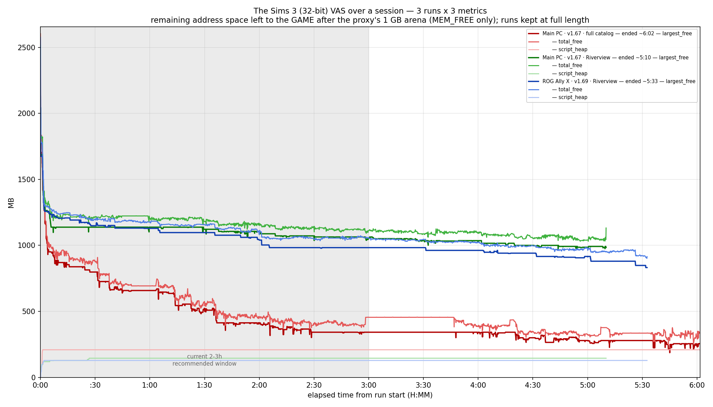

# TS3VASManager

TS3VASManager is a lightweight, low-level memory management and telemetry utility designed specifically for tracking and mitigating Virtual Address Space (VAS) pressure, memory leaks, and frame hitches in *The Sims 3* (32-bit game client). 

By intercepting heap operations and virtual memory allocations, the system redirects large allocations into a dedicated, contiguous 1 GB private proxy arena. This compact layout reduces addressing overhead and optimizes recycling paths before the application exhausts its native memory space.

---

## 📜 Origins & Why This Exists

TS3VASManager began as a derivative of [**cmedina-dev/TS3-64bit-Patch**](https://github.com/cmedina-dev/TS3-64bit-Patch), and we owe that project credit for the original idea, the hook scaffolding, and the telemetry groundwork it gave us. This tool is a derivative work and remains licensed under the **GNU GPL v3.0**, in keeping with its parent.

That project set out to defeat the 32-bit VAS wall in the most direct way imaginable: stand up a **separate 64-bit "memory server" process** with access to the full 8 TB address space, hook the game's large allocations, and ship the bytes across an IPC named pipe — handing the 32-bit game a tiny 4-byte *proxy pointer* while the real data lived remotely. On paper it's elegant: the game believes it holds 10 MB; the 10 MB actually sits in a process that isn't running out of address space.

In practice the model fights physics. A returned allocation pointer isn't just a token the game hands back to `free()` later — the game **reads and writes through it directly, constantly**. A 4-byte proxy cannot satisfy a direct read of byte 9,000,000. To preserve the illusion you must intercept every access, mirror the remote memory into a **local cache**, and write it back across the pipe — which means (a) paying IPC and copy cost on a workload that touches memory millions of times per second, and (b) keeping a cross-process cache **coherent** for a game that never agreed to cooperate. The parent project's own commit history tells the story: most of its later work is `CacheCoherencyManager`, `CacheIntegrityChecker`, `AsyncCacheWriter`, "stabilization of cache read/writes," and finally "Improvements on load data corruption." The corruption was not a bug waiting to be squashed — it was the architecture asking for the impossible: transparent remote memory for an application that assumes local memory.

So TS3VASManager kept the diagnosis and discarded the cure. **The bytes never leave the game's process.** Instead of relocating large allocations to a second process, we reserve a single contiguous **1 GB private arena inside the game's own address space** and redirect the big allocations into it, eager-committed, as **real, directly-usable pointers**. There is no server, no IPC, no proxy-pointer illusion, and nothing to keep coherent — because nothing was ever moved. We don't escape the ~2 GB ceiling; we stop the game from **shattering** it into unusable fragments, which is what actually triggers "Error 12" long before the space is genuinely full. Everything the old server architecture required — the 64-bit `TS3MemoryServer`, the `TS3MemoryClient`, the IPC protocol, the entire cache pipeline — has been removed, and what remains has diverged substantially: Microsoft Detours in place of MinHook, a sharded sub-allocator, containment-lane classification, a Mono script-heap bridge, and ETW instrumentation.

---

## 🏗️ System Architecture & Core Components

The framework is divided into multiple subsystem modules that handle distinct aspects of injection, hooking, heap routing, and diagnostics:

### 1. Launcher & Injector (`TS3Launcher.exe`)
* **Dual Operation Modes**: Automatically identifies the game installation version to determine the optimal injection style:
  * **DIRECT Mode (1.67 Disc / 1.70 Steam)**: Uses `DetourCreateProcessWithDllExA` to inject the hooking library at the earliest possible stage prior to the game's Original Entry Point (`pre-OEP`).
  * **MONITOR Mode (1.69 EA App / Origin)**: Spawns the intermediate `Sims3Launcher.exe` (if present) or prompts the user to launch the game via the platform client. It then polls for the active game process and injects the runtime DLL via a remote thread using `CreateRemoteThread` + `LoadLibraryA`.

### 2. Runtime Hook Manager (`TS3VASManager.dll`)
* **API Redirection**: Utilizes the Microsoft Detours library to hook low-level Windows memory APIs and NT native runtime boundaries (`RtlAllocateHeap`, `RtlFreeHeap`, `NtAllocateVirtualMemory`, `NtMapViewOfSection`, and file mapping methods).
* **Containment Lanes**: Classifies each allocation by its calling module (Game Exe, Mod, System DLL, or Graphics Driver) into a **Contained** lane (game/CPU memory the arena manages) or an **Excluded** lane (graphics-driver memory left untouched). The labels are telemetry only — they do not change placement — and are sharded A–D by thread id to keep the per-lane counters lock-light.
* **Proxy Arena Management**: Features an exclusive, contiguous 1 GB `ProxyAllocator` heap with eager page-commitment. Large heap and `VirtualAlloc` requests are redirected into the arena by **allocation size**, so the game's biggest allocations land in one recyclable region instead of fragmenting the wider 32-bit address space. A private sharded sub-allocator ("sardine" LFH heaps) packs the many sub-64 KB allocations efficiently inside the same arena, with graphics-driver heaps explicitly excluded to avoid corrupting driver-owned metadata.

### 3. Telemetry & Analytics Subsystems

> The heavy observe-only instrumentation below (map-view tracking, file-read scanning, package reporting, the D3D9 resource table) is compiled **only into the debug/telemetry build** (`TS3VAS_TELEMETRY=ON`). The lean play build keeps just the heartbeat and the core hooks.

* **Heartbeat Monitor (in-process background threads)**: Runs a persistent background loop inside the injected DLL to capture process memory profiles (total-free / largest-free address space) and log structural deltas across gameplay phases. The current managed (Mono) script-heap size is bridged in alongside, so VAS and script-heap pressure can be charted together.
* **Map View Type Tracker**: Compiles a real-time inventory of `NtMapViewOfSection` events. It categorizes section types, reads and unpacks DBPF resource type indexes inside packages/worlds (e.g., `GEOM`, `TXTR`), and charts cumulative sizes to detect asset-driven leaks.
* **Script Scanning & Deduplication**: Employs a lock-free, open-addressing hash table backed by FNV-1a hashing to cross-reference script package assets across parallel mapping and file reading paths, ensuring resource tracking numbers remain distinct.
* **Hitch Detection & Stack Walking**: Asynchronously tracks game framerates and disk I/O activity. When specific performance or execution duration thresholds are exceeded, call stack traces are parsed through a specialized worker thread to avoid blocking the main simulation thread.
* **Event Tracing for Windows (ETW)**: Exposes a high-performance manifest provider under the name `"TS3VASManager-Memory"` (GUID: `{3A1F8D2C-BE47-4C9A-85E0-2A6F3D9C1B74}`). This allows engineers to stream raw runtime alloc/free hooks directly into performance analyzers like Windows Performance Analyzer (WPA) or PerfView.

### 4. Memory Bridge & Garbage Collection (`ProxyGc`)
* **Mono Virtual Machine Memory Bridge**: The game engine's embedded Mono scripting system is blind to external native memory limits. `ProxyGc` sets up a dedicated cross-process shared-memory section to publish the managed heap size metrics. When native address space drops below specific safety marks, it pulses a named auto-reset event (`"Local\TS3VAS_MonoGcRequest"`) to trigger proactive Mono garbage collection cycles safely through a companion script mod.

---

## ⚙️ Environment Variables (Tunables)

TS3VASManager checks the following system environment variables at initialization to modify its internal telemetry limits, tracking sensitivity, and debug logic:

| Variable | Default Value | Description |
| :--- | :---: | :--- |
| `TS3VAS_HITCH_INTERVAL_MS` | `250` | The millisecond timeframe a frame loop must exceed to be classified as a simulation hitch. |
| `TS3VAS_HITCH_CAPTURE_STACKS` | `0` | Set to `1` to capture and generate complete call stack logs during recorded frame hitches. |
| `TS3VAS_HITCH_READFILE_THRESHOLD` | `2000` | Microsecond or operation duration threshold used for catching file read stalls. |
| `TS3VAS_HITCH_ALLOC_THRESHOLD` | `20000` | Performance evaluation threshold checking for prolonged heap allocation requests. |
| `TS3VAS_HITCH_FREE_THRESHOLD` | `20000` | Performance evaluation threshold checking for prolonged heap deallocation requests. |
| `TS3VAS_GC_PRESSURE_MB` | `1024` | The largest-free VAS threshold (in MB) below which the proactive Mono garbage-collection pressure routine fires more aggressively. |
| `TS3VAS_GC_INTERVAL_SEC` | `60` | The basic interval period (in seconds) used to routinely prompt the managed scripting garbage collector when the environment has ample free address space. |

---

## 🛠️ Build and Compilation Targets

The project workspace requires distinct architectural build setups due to the target environment's technical specifications:

1. **`TS3VASManager.dll` (in-game hook component)**:
   * **Target Architecture**: 32-bit (x86 MSVC). It is injected into the 32-bit game process, so the architectures must match — CMake enforces this with an x86 guard.
   * **Prerequisites**: Links against the Microsoft Detours library to perform the API hooking.
   * **Two build flavors** (both produced by `build.bat`):
     * **Play build** (`TS3VAS_TELEMETRY=OFF` → `TS3VASManager_play.dll`): working hooks only (heap / virtual-memory redirection). The observe-only hooks are stripped by the linker (`/OPT:REF`). This is the lean build for everyday play.
     * **Debug/telemetry build** (`TS3VAS_TELEMETRY=ON` → `TS3VASManager.dll`): adds the full observe-only hook set (D3D9 / Present, map-view, file-read, package reporting) that produces the diagnostic logs.
2. **`TS3Launcher.exe` (launcher / injector)**:
   * **Target Architecture**: 32-bit (x86), matching the game and the DLL.

---

## 💾 Installation & Usage Instructions

1. Locate the core binary installation directory of the game client:
   * **EA App / Origin Defaults**: `C:\Program Files\EA Games\The Sims 3\Game\Bin`
   * **Steam Defaults**: `C:\Program Files (x86)\Steam\steamapps\common\The Sims 3\Game\Bin`
2. Copy the compiled components into this game binary path:
   * `TS3Launcher.exe`
   * `TS3VASManager.dll` (the play build, or the telemetry build if you want diagnostic logs)
3. **Execution**: Always run your game using `TS3Launcher.exe`. 
   * *Note*: If you encounter injection errors, process boundary issues, or missing function targets, right-click `TS3Launcher.exe` and select **Run as Administrator**.

### 📊 Log Files and Diagnostics
By default, the program outputs execution reports, error snapshots, and memory channel data directly to the local system directory:
* **Output Path**: `C:\ts3_tool\`
* High-volume tracing components dump data to granular, specialized target streams such as `MEMHOOK`, `CPU_TABLE`, `GPU_TABLE`, and `MAPVIEW_REPORT` channels to prevent flooding the live tracking console.

---

## 🧪 Test Configuration & Reference Data

To make the testing conditions transparent, the repository includes a real capture of everything loaded during a session — so you can see exactly what the tool is being exercised against rather than taking "heavily modded" on faith.

[`docs/sample-logs/PACKAGE_LOAD.txt`](docs/sample-logs/PACKAGE_LOAD.txt) is an unedited `PACKAGE_LOAD` report (each distinct package/world logged once with its size) from a full-catalog, heavily-modded run: the complete NRaas script-mod suite, every base/EP/store world, and an active save (Storybrook County) whose `_sims` and `_objects` packages alone are ~500 MB each. This is a deliberately punishing load — the kind of configuration that reliably triggers "Error 12" on a stock 32-bit client.

A companion line graph captures `largest_free` / `total_free` VAS alongside the managed script-heap, so allocation pressure and the loaded content can be read together:

Nine lines: **three real play sessions, three metrics each.** Each run is a base colour — **red** = Main PC (v1.67) under the full content catalog, **green** = Main PC (v1.67) on a fresh Riverview save, **blue** = ROG Ally X handheld (v1.69) on a fresh Riverview save. Within a run, the three shades are `largest_free` (darkest), `total_free` (mid) and `script_heap` (lightest). Each session is plotted at its **full, individual length** (the length is the point), with the current **2–3 hour recommended window shaded** for reference — every line runs well past it, to 5:10, 5:33 and 6:02. The raw data and the script that produced this chart live in [`docs/vas_comparison.csv`](docs/vas_comparison.csv) and [`docs/make_vas_graph.py`](docs/make_vas_graph.py).

### How to read the VAS numbers in the graph

`total_free` and `largest_free` are **the address space left to the *game*, not to the whole process** — measured *after* the proxy has already taken its share. The heartbeat thread walks the process address space (`VirtualQuery`) and sums **only the regions in the `MEM_FREE` state** — address space that is neither reserved nor committed. `total_free` is the sum of every free region; `largest_free` is the single biggest *contiguous* free block (the one that matters for a large allocation, and usually the first thing to fail — it's why "Error 12" can strike with hundreds of MB still nominally free but no single block big enough).

Crucially, the tool reserves its **contiguous 1 GB proxy arena up front**, for the entire life of the process. A reservation is not `MEM_FREE`, so the arena — every byte of it, whether currently holding a redirected allocation or sitting empty inside — is **excluded from these two numbers by design**. In other words, the graph shows the headroom the game has *to grow into* once two things have already been subtracted: the ~1 GB the proxy claimed, and whatever the loaded save / new game pulled in during world-load. A run that boots with ~2 GB free settling to ~1 GB after load and the arena reservation is normal and healthy — that ~1 GB is the runway, and the whole point of the tool is to keep large allocations *out* of it so it drains slowly.

The arena's own internal free space is a **separate pool** and is **not** part of `total_free` / `largest_free`. It is reported on its own in the `PROXY_ARENA_REPORT` channel (`used` / `free` / `largest_free` *inside* the 1 GB reservation). Because the arena recycles allocations internally, that pool stays roughly flat while the game's unproxied VAS is what the graph tracks bleeding away over a session. True total headroom, if you want it, is the graphed `total_free` plus the arena's reported internal `free`.

---

## 🔍 Deprecated and Retired Legacy Subsystems

As the architecture matured, several legacy features were removed or changed to preserve stability and optimize memory usage:

* **D3D9 activation trigger (now `ObserverHooks`)**: The D3D9 `Present` hook originally gated *when* the proxy went live. That dependency was removed — hooks now install at process start and `RtlAllocateHeap` catches allocations from the first instruction. The D3D9 hooks survive only as observe-only frame/resource telemetry, compiled into the debug/telemetry build and **enabled by default** there (set `TS3VAS_ENABLE_D3D9_HOOK=0` to disable).
* **Proxy Slot Address Scanner**: Historically part of the `ProxyGc` module to check for abandoned objects inside the memory proxy region. Long-duration stress tests confirmed that memory blocks were consistently recycled cleanly by the game executable, yielding zero leaks inside the proxy, and leading to its complete removal.
* **Vectored Exception Handling (VEH)**: A per-page lazy-commit fault handler originally monitored the proxy arena. Because the allocation matrix shifted to an enthusiastic eager-commit model, proxy address space pages never experience page faults, making the VEH subsystem completely obsolete.

---

## 🙏 Acknowledgements

* **[cmedina-dev/TS3-64bit-Patch](https://github.com/cmedina-dev/TS3-64bit-Patch)** — the GPL-3.0 parent project this tool is derived from. See *Origins & Why This Exists* above for the lineage and the reasons behind the architectural divergence.
* Development was assisted by AI coding tools — **Claude** (Anthropic) and **Codex** (OpenAI). They drafted and refactored code under human direction; authorship and copyright remain with the project's human maintainers.